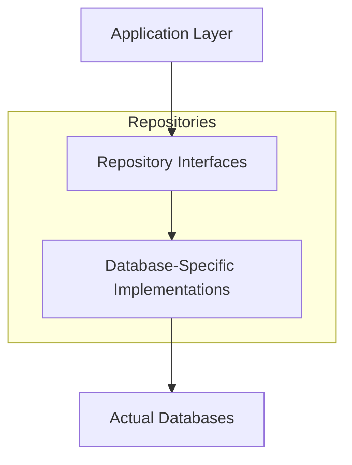
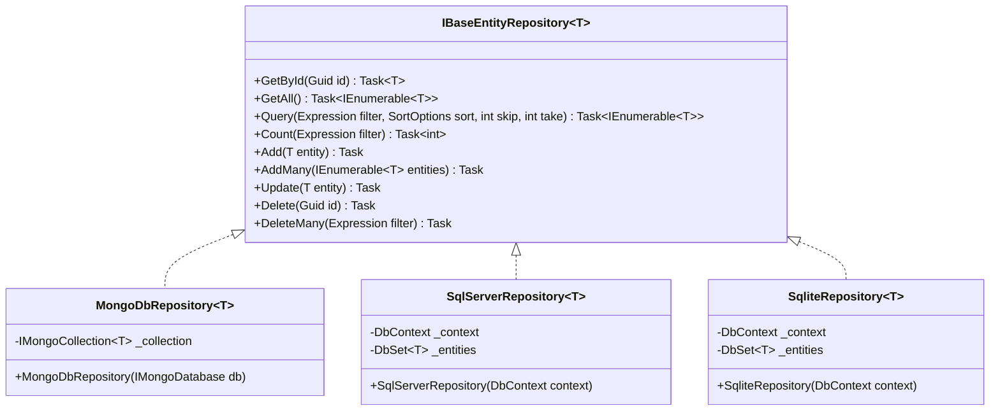
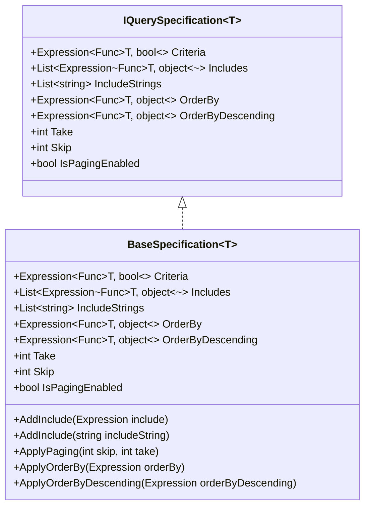
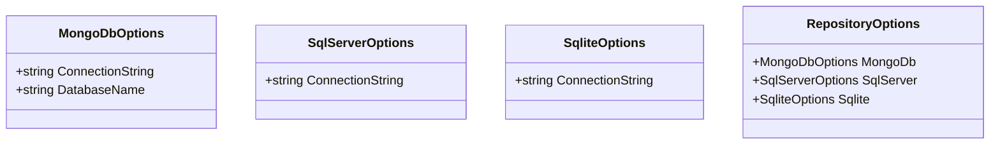
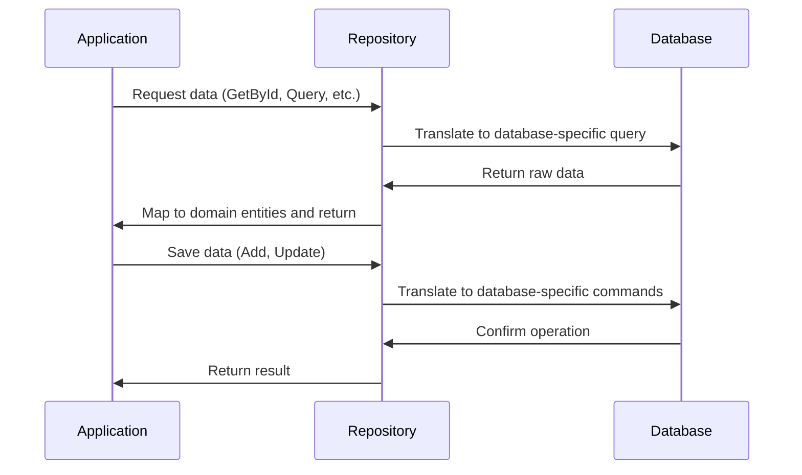

# System Patterns

## Architecture Overview

FluentCMS.Repositories implements a layered architecture with clear separation of concerns:



## Core Design Patterns

### Repository Pattern

The core pattern is the Repository Pattern, which:
- Mediates between the domain and data mapping layers
- Provides a collection-like interface for domain objects
- Hides query complexity and data access details from business logic

Implementation approach:
- Generic interfaces defining standard operations
- Database-specific implementations of these interfaces
- Query objects for complex data retrieval

### Generic Repository



### Query Specification Pattern

For more complex queries, a specification pattern can be implemented:



### Options Pattern

For configuration:



## Extension Methods for DI Registration

```csharp
// Example pattern for service registration
public static class ServiceCollectionExtensions
{
    public static IServiceCollection AddRepositories(this IServiceCollection services, Action<RepositoryOptions> configureOptions)
    {
        // Configure options
        services.Configure(configureOptions);
        
        // Register common services
        services.AddScoped(typeof(IBaseEntityRepository<>), typeof(ConcreteRepositoryImplementation<>));
        
        return services;
    }
    
    public static IServiceCollection AddMongoDbRepositories(this IServiceCollection services, Action<MongoDbOptions> configureOptions)
    {
        // Configure MongoDB options
        services.Configure(configureOptions);
        
        // Register MongoDB specific services
        services.AddSingleton<IMongoClient>(sp => {
            var options = sp.GetRequiredService<IOptions<MongoDbOptions>>().Value;
            return new MongoClient(options.ConnectionString);
        });
        
        services.AddScoped(typeof(IBaseEntityRepository<>), typeof(MongoDbRepository<>));
        
        return services;
    }
    
    // Similar methods for SQL Server and SQLite
}
```

## Data Flow



## Key Implementation Details

1. **Entity Interface**:
   ```csharp
   public interface IBaseEntity
   {
       Guid Id { get; set; }
   }
   ```

2. **Expression Translation**: Each database implementation will need to translate LINQ expressions to its native query language (MongoDB expressions, SQL, etc.)

3. **Pagination Handling**: Consistent skip/take implementation across all providers

4. **Error Handling**: Standardized approach to database errors and conversion to meaningful exceptions

5. **Performance Considerations**: 
   - Efficient query generation
   - Proper use of indexes
   - Minimizing unnecessary round trips to the database
